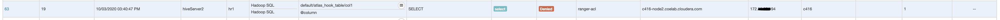

# Ranger geo location based policies

This doc provides the steps to use RangerFileBasedGeolocationProvider to enforce ranger policies based on user’s location identified based on pre-defined IP to location mapping file.  This feature was implemented in Ranger 0.6.0 RANGER-596. 

### Enable RangerFileBasedGeoLocationProvider in Ranger admin: 

**Step 1:** Update the hive service definition : 

```
# curl -u admin  -H 'Content-Type: application/json'  -X GET 'http://c416-node4.coelab.cloudera.com:6080/service/public/v2/api/servicedef/name/hive'
```

**Step 2 :**  Add contextEnrichers with name GeoEnricher
```
"contextEnrichers": [
    {
      "itemId": 1,
      "name": "GeoEnricher",
      "enricher": "org.apache.ranger.plugin.contextenricher.RangerFileBasedGeolocationProvider",
      "enricherOptions": {
        "FilePath": "/etc/ranger/geo/geo.txt",
        "IPInDotFormat": "true"
      }
    }
  ]
```

**Step 3:**  In same file Add policyConditions

```
"policyConditions": [
    {
      "itemId": 1,
      "name": "location-outside",
      "label": "Accessed from outside of location?",
      "description": "Accessed from outside of location?",
      "evaluator": "org.apache.ranger.plugin.conditionevaluator.RangerContextAttributeValueNotInCondition",
      "evaluatorOptions": {
        "attributeName": "LOCATION_COUNTRY_CODE"
      }
    }
  ]
```

**Step 4:** Create geo.txt file path mentioned in contextEnricher with IP address and country codes in below format. (IP_FROM and IP_TO are set to same to mention one host)

```
 # cat /etc/ranger/geo/geo.txt
IP_FROM,IP_TO,COUNTRY_CODE,COUNTRY_NAME,REGION,CITY
172.xyz.xyz.209,172.xyz.xyz.209,US,United States,California,Santa Clara
172.xyz.v.152,172.xyz.xyz.152,US,United States,Colorado,Broomfield
172.xyz.xyz.218,172.xyz.xyz.218,US,United States,Texas,Irving
172.xyz.xyz.68,172.xyz.xyz.68,US,United States,Texas,Irving
```


**Note:** This file should exists on the plugin service (here on HS2 server) as the policy is enforced at plugin, plugin will re-read this geo.txt when a policy is updated. 

To add a new IP address to this file, make sure that hive policy is updated (any change to trigger sync, every time geo.txt is updated). This step is required as there is no watcher implemented on geo enricher source file so modifications to this file are not auto loaded by plugin. 


**Step 5:** Update the service definition: 

```
#curl -u admin  -H 'Content-Type: application/json'  -X PUT -d @./hive_servicedef_geolocation.json 'http://c416-node4.coelab.cloudera.com:6080/service/public/v2/api/servicedef/name/hive' -v
```

### Adding hive policy to test geo location based policies: 

Create a hive policy as below in ranger UI : 

> Policy Name : GeoTest

> Database: default

> Table : atlas_hook_table

> Column : *


**Allow policy :**  (Allow all permissions to table atlas_hook_table when hr1 user accessing from location outside IN)

> User : hr1

> Policy Condition: IN (which should be location-outside: IN)

> Permissions : All 


**Deny policy :**  (deny all permissions to table atlas_hook_table when hr1 user accessing from outside US)

> User : hr1

> Policy Condition: US   (which should be location-outside: US)

> Permissions : All 


With the above policy created, user hr1 is allowed to access from IP address which is outside IN (from geo.txt all the IPs mapped to US location, so this condition should be enforced when user access atlas_hook_table table from any of the mapped IPs).

#### Testing the geo location policy : 

Access from IP address 172.xyz.xyz.194, which is not mapped or mentioned in geo.txt , without mapping this IP is non-US or outside US and matches our policy to deny: 

**Test 1:**  Access HS2 as user hr1  using beeline shell : 

```
0: jdbc:hive2://c416-node2.coelab.cloudera.co> !sh ip addr
1: lo: <LOOPBACK,UP,LOWER_UP> mtu 65536 qdisc noqueue state UNKNOWN group default qlen 1000
    link/loopback 00:00:00:00:00:00 brd 00:00:00:00:00:00
    inet 127.0.0.1/8 scope host lo
       valid_lft forever preferred_lft forever
    inet6 ::1/128 scope host
       valid_lft forever preferred_lft forever
3292: eth0@if7: <BROADCAST,MULTICAST,UP,LOWER_UP> mtu 1500 qdisc noqueue state UNKNOWN group default
    link/ether 02:42:ac:19:27:c2 brd ff:ff:ff:ff:ff:ff link-netnsid 0
    inet 172.xyz.xyz.194/20 brd 172.xyz.xyz.255 scope global eth0
       valid_lft forever preferred_lft forever
    inet6 fe80::42:acff:fe19:27c2/64 scope link
       valid_lft forever preferred_lft forever
```

Access to table atlas_hook_table is denied for user hr1: 

```
0: jdbc:hive2://c416-node2.coelab.cloudera.co>  select * from atlas_hook_table;
Error: Error while compiling statement: FAILED: HiveAccessControlException Permission denied: user [hr1] does not have [SELECT] privilege on [default/atlas_hook_table/*] (state=42000,code=40000)

```


Review the Ranger audit to confirm the denied condition enforced. 




Access from IP address 172.xyz.xyz.68 which is mapped to location US in geo.txt. 

```
0: jdbc:hive2://c416-node2.coelab.cloudera.co> !sh ip addr
1: lo: <LOOPBACK,UP,LOWER_UP> mtu 65536 qdisc noqueue state UNKNOWN group default qlen 1000
    link/loopback 00:00:00:00:00:00 brd 00:00:00:00:00:00
    inet 127.0.0.1/8 scope host lo
       valid_lft forever preferred_lft forever
    inet6 ::1/128 scope host
       valid_lft forever preferred_lft forever
3177: eth0@if7: <BROADCAST,MULTICAST,UP,LOWER_UP> mtu 1500 qdisc noqueue state UNKNOWN group default
    link/ether 02:42:ac:19:2a:44 brd ff:ff:ff:ff:ff:ff link-netnsid 0
    inet 172.xyz.xyz.68/20 brd 172.xyz.xyz.255 scope global eth0
       valid_lft forever preferred_lft forever
    inet6 fe80::42:acff:fe19:2a44/64 scope link
       valid_lft forever preferred_lft forever
```

```
0: jdbc:hive2://c416-node2.coelab.cloudera.co>  select * from atlas_hook_table;
[..]

+------------------------+------------------------+
| atlas_hook_table.col1  | atlas_hook_table.col2  |
+------------------------+------------------------+
+------------------------+------------------------+
No rows selected (0.19 seconds)
```

Confirming the current user : 

```
0: jdbc:hive2://c416-node2.coelab.cloudera.co> select current_user();
[..]
+------+
| _c0  |
+------+
| hr1  |
+------+
1 row selected (0.154 seconds)
```


Review the audit logs from ranger UI to confirm  same policy enforced for user hr1 for Allow and denied access but when accessed from different client IP. 


Above test confirms Ranger geo policy is enforced and same user accessing same resources  from two different client IPs has two different policies enforced. 
